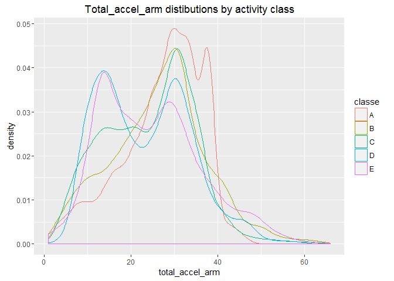
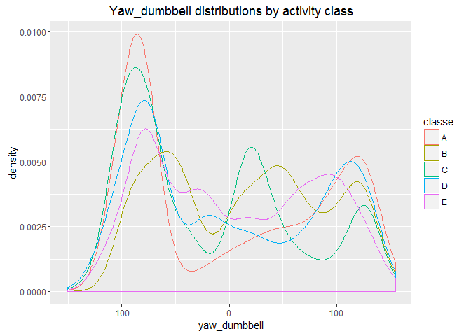
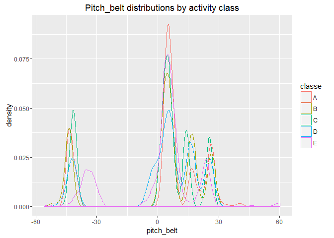
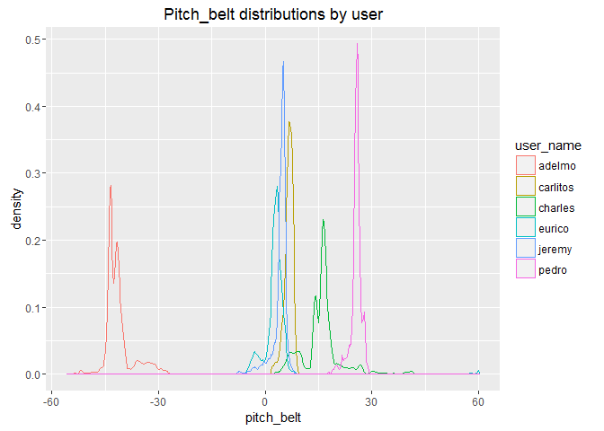
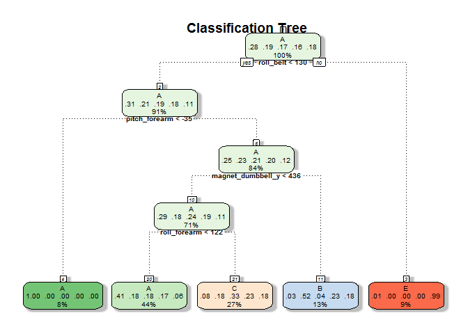

# Course Project - Practical Machine Learning
Barbara Moloney  
8 May 2016  
####Synopsis

This report describes the analysis of Human Activity Recognition (HAR) data to evaluate how well the users performed a number of tasks with sensors on the belt, arm, dumbbell and forearm.
Three different machine learning algorithms were applied and performance was based on the accuracy of prediction (ie minimised out of sample errors). The best performing model was random forests with an out of sample error of 0.009.

####Background

Using devices such as Jawbone Up, Nike FuelBand, and Fitbit it is now possible to collect a large amount of data about personal activity relatively inexpensively. These type of devices are part of the quantified self movement – a group of enthusiasts who take measurements about themselves regularly to improve their health, to find patterns in their behavior, or because they are tech geeks. One thing that people regularly do is quantify how much of a particular activity they do, but they rarely quantify how well they do it. 

In this project, your goal will be to use data from accelerometers on the belt, forearm, arm, and dumbell of 6 participants. They were asked to perform barbell lifts correctly and incorrectly in 5 different ways. More information is available from the website here: http://groupware.les.inf.puc-rio.br/har (see the section on the Weight Lifting Exercise Dataset).

Participants were asked to perform one set of 10 repetitions of the Unilateral Dumbbell Biceps Curl in five different fashions:
exactly according to the specification (Class A)
throwing the elbows to the front (Class B)
lifting the dumbbell only halfway (Class C)
lowering the dumbbell only halfway(Class D) and 
throwing the hips to the front (Class E). 
Class A corresponds to the specified execution of the exercise, while the other 4 classes correspond to common mistakes.

####Data

The training data for this project are available here:

https://d396qusza40orc.cloudfront.net/predmachlearn/pml-training.csv

The test data are available here:

https://d396qusza40orc.cloudfront.net/predmachlearn/pml-testing.csv

One thing that people regularly do is quantify how much of a particular activity they do, but they rarely quantify how well they do it. In this project, your goal will be to use data from accelerometers on the belt, forearm, arm, and dumbell of 6 participants.

####What has been submitted

The goal of this project is to predict the manner in which the users did the exercise. This is the "classe" variable in the training set. I have used 52 of the measurement variables as predictors. All derived variables have been removed as some had errors in the calculations and all were predominantly missing values.

I have created a report describing how I built the models, how I used cross validation, what I think the expected out of sample errors are, and why I chose the particular model I used. 

In this analysis I have selected 60% of the training data for model training and 40% of the training data for testing each of 3 models: k-nearest-neigbours, rpart classification tree and random forest classification algorithm. I chose the best model based on accuracy (ie minimum out of sample error).

I used my prediction model to predict 20 different test cases which have been submitted separately as the Project Prediction Quiz (not for peer review). 

####Peer Review Portion

My submission for the Peer Review portion consists of a link to a Github repo with my R markdown and compiled HTML file describing my analysis. I have submitted a repo with a gh-pages branch so the HTML page can be viewed online.

###Analysis

####Add packages that are needed for producing the report

```r
library(ggplot2)
library(dplyr)
library(lubridate)
library(xtable)
library(caret)
library(rpart)
library(randomForest)
```

####Download the training and test data


```r
# Download the training and test data
fileUrl <- "https://d396qusza40orc.cloudfront.net/predmachlearn/pml-training.csv?accessType=DOWNLOAD"
download.file(fileUrl,destfile = "pml-training.csv")
fileUrl1 <- "https://d396qusza40orc.cloudfront.net/predmachlearn/pml-testing.csv?accessType=DOWNLOAD"
download.file(fileUrl1,destfile = "pml-testing.csv")

training <- read.csv("pml-training.csv", stringsAsFactors = FALSE)
testing <- read.csv("pml-testing.csv", stringsAsFactors = FALSE)
```


####Exploring the training data and preliminary cleaning:
The training data contain 19622 observations and 160 variables.
The derived variables for each of the accelerometer measurements (max, min, kurtosis, skewness, amplitude) are calculated for each time window, and not each observation. However examination of the data show that at least some the calculations of derived variables are incorrect: for example in the first 100 observations there are values of max_roll_belt in the dataset = -94.3, whereas full dataset has a minimum of the roll_belt variable being -28.9 as shown below.


```r
unique(select(training[1:100,], starts_with("max_roll")))
```

```
##    max_roll_belt max_roll_arm max_roll_dumbbell max_roll_forearm
## 1             NA           NA                NA               NA
## 24         -94.3         22.3             -70.1            -63.7
## 52         -94.1         20.7             -70.0            -63.6
## 76         -94.1         19.4             -70.0            -63.6
```

```r
summary(select(training, starts_with("roll")))
```

```
##    roll_belt         roll_arm       roll_dumbbell      roll_forearm      
##  Min.   :-28.90   Min.   :-180.00   Min.   :-153.71   Min.   :-180.0000  
##  1st Qu.:  1.10   1st Qu.: -31.77   1st Qu.: -18.49   1st Qu.:  -0.7375  
##  Median :113.00   Median :   0.00   Median :  48.17   Median :  21.7000  
##  Mean   : 64.41   Mean   :  17.83   Mean   :  23.84   Mean   :  33.8265  
##  3rd Qu.:123.00   3rd Qu.:  77.30   3rd Qu.:  67.61   3rd Qu.: 140.0000  
##  Max.   :162.00   Max.   : 180.00   Max.   : 153.55   Max.   : 180.0000
```
For this reason all derived variables will be removed from the dataset. Another advantage of doing this is that it will reduce the likelihood of colliniarity between variables.


```r
# Remove the derived variables
training1 <- select(training, -starts_with("kurtosis"))
training1 <- select(training1, -starts_with("skew"))
training1 <- select(training1, -starts_with("max"))
training1 <- select(training1, -starts_with("min"))
training1 <- select(training1, -starts_with("amp"))
training1 <- select(training1, -starts_with("avg"))
training1 <- select(training1, -starts_with("var"))
training1 <- select(training1, -starts_with("stddev"))

#convert strings to factors and date
training1$user_name <- as.factor(training1$user_name)
training1$new_window <- as.factor(training1$new_window)
training1$classe <- as.factor(training1$classe)
training1$cvtd_timestamp <- parse_date_time(training1$cvtd_timestamp, "dmy HM")
```

This reduces the dataset from 160 to 60 variables and is now referred to as "training1"
The table below shows the total number of observations by user and class. As can be seen in the table, all users had similar numbers of observations for each class of activity.


```r
user <- table(training1$user_name, training1$classe)
xt <- xtable(user)
print(xt, type="html")
```

<!-- html table generated in R 3.2.5 by xtable 1.7-4 package -->
<!-- Sun May 08 17:21:01 2016 -->
<table border=1>
<tr> <th>  </th> <th> A </th> <th> B </th> <th> C </th> <th> D </th> <th> E </th>  </tr>
  <tr> <td align="right"> adelmo </td> <td align="right"> 1165 </td> <td align="right"> 776 </td> <td align="right"> 750 </td> <td align="right"> 515 </td> <td align="right"> 686 </td> </tr>
  <tr> <td align="right"> carlitos </td> <td align="right"> 834 </td> <td align="right"> 690 </td> <td align="right"> 493 </td> <td align="right"> 486 </td> <td align="right"> 609 </td> </tr>
  <tr> <td align="right"> charles </td> <td align="right"> 899 </td> <td align="right"> 745 </td> <td align="right"> 539 </td> <td align="right"> 642 </td> <td align="right"> 711 </td> </tr>
  <tr> <td align="right"> eurico </td> <td align="right"> 865 </td> <td align="right"> 592 </td> <td align="right"> 489 </td> <td align="right"> 582 </td> <td align="right"> 542 </td> </tr>
  <tr> <td align="right"> jeremy </td> <td align="right"> 1177 </td> <td align="right"> 489 </td> <td align="right"> 652 </td> <td align="right"> 522 </td> <td align="right"> 562 </td> </tr>
  <tr> <td align="right"> pedro </td> <td align="right"> 640 </td> <td align="right"> 505 </td> <td align="right"> 499 </td> <td align="right"> 469 </td> <td align="right"> 497 </td> </tr>
   </table>

####Density plots
Density plots for a sample of the variables are shown below. In all examples the class = "A" for the correct performance of the tasks has a higher maximum density. Also as the last plot by user shows the multiple peaks can be explained by differences between users.


```r
qplot(total_accel_arm, data = training1, color = classe, geom = "density", main = "Total_accel_arm distibutions by activity class")
```

<!-- -->

```r
qplot(yaw_dumbbell, data = training1, color = classe, geom = "density", main = "Yaw_dumbbell distributions by activity class")
```

<!-- -->

```r
qplot(pitch_belt, data = training1, color = classe, geom = "density", main = "Pitch_belt distributions by activity class")
```

<!-- -->

```r
qplot(pitch_belt, data = training1, color = user_name, geom = "density", main = "Pitch_belt distributions by user")
```

<!-- -->

####Subset the training1 data for model development
60% training, 40% testing. Extract numeric variables only for model development. The dataframe of 52 numeric variables and classe are now referred to as trainingPred.


```r
set.seed(1234)
inTrain <- createDataPartition(y=training1$classe,
    p=0.60, list=FALSE)
train <- training1[inTrain,]
test <- training1[‐inTrain,]
trainingPred <- train[,8:60]
```

####Fit candidate models and compare.
Because the dependent variable (classe) in this data is categorical with multiple categories and the predictors used are all numeric, the appropriate model types to use are classification trees, k nearest neigbours, random forests. 

*1. Fit the KNN model and evaluate performance.*  

```r
#register cores to enable parallel processing with caret
library(foreach)
library(doParallel)
registerDoParallel(cores = 4)	

# fit knn model
set.seed(32343)
modelFitknn <- train(classe ~., data=trainingPred, method="knn")

# predict using the 40% test data
predknn <- predict(modelFitknn, newdata = test)
cmat <- confusionMatrix(predknn, test$classe)
# accuracy and out of sample error
cmat$overall[[1]]
```

```
## [1] 0.9014785
```

```r
1-cmat$overall[[1]]
```

```
## [1] 0.09852154
```

The KNN model has an out of sample error rate of 0.0985215 and overall accuracy of 0.9014785 which is good performance.  

*2. fit the CART classification tree model and evaluate performance.*
A plot of the classification tree is also shown. A cross-validation tuning parameter (k = 10, most commonly used) was added to repeat the model fit.

```r
modFitrpt <- train(classe ~ ., data=trainingPred, method = "rpart")
predrpt <- predict(modFitrpt, newdata=test)
cmat1 <- confusionMatrix(predrpt, test$classe)
cmat1$overall[[1]]
```

```
## [1] 0.490441
```

```r
1-cmat1$overall[[1]]
```

```
## [1] 0.509559
```

```r
library(rattle)
fancyRpartPlot(modFitrpt$finalModel, main = "Classification Tree", sub = "", cex=0.6)
```

<!-- -->

```r
#refit the "rpart" model with cross-validation
#makes no difference to the accuracy
ctrl <- trainControl(method = "repeatedcv", repeats = 10)
modFitrpt <- train(classe ~ ., data=trainingPred, method = "rpart", trControl=ctrl)
predrpt <- predict(modFitrpt, newdata=test)
cmat1 <- confusionMatrix(predrpt, test$classe)
cmat1$overall[[1]]
```

```
## [1] 0.490441
```

```r
1-cmat1$overall[[1]]
```

```
## [1] 0.509559
```

Performance using "rpart" classification tree is very poor with an overall error rate of 0.0985215 and accuracy of0.9014785. No improvement was gained by using cross-validation.  

*3. Fit the random forests model*  

```r
modFitrf <- train(classe ~ ., method = "rf", data=trainingPred)
predrf <- predict(modFitrf, newdata=test)
cmat2 <- confusionMatrix(predrf, test$classe)
cmat2$overall[[1]]
```

```
## [1] 0.9903135
```

```r
1-cmat2$overall[[1]]
```

```
## [1] 0.009686464
```
Performance using "rf" random forests classification is excellent with an overall error rate of 0.0096865 and accuracy of0.9903135  

####Conclusions
The best model out of the 3 examined was the random forests algorithm. The performance of each model is as follows:

Algorithm used  | Accuracy | Out of sample error
----------------|----------|--------------------       
KNN             | 0.90148  | 0.09852            
Classif Tree    | 0.49044  | 0.50956            
Random Forests  | 0.00930  | 0.99070

Note: cross-validation was not used on either the knn or rf algorithms as they were very slow to run even without it.

